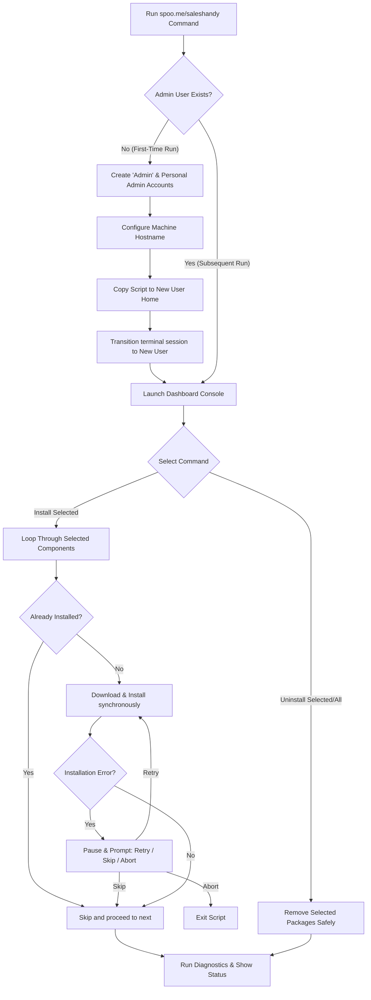

# 🚀 Interactive Ubuntu Post-Install Setup Dashboard

[](https://ubuntu.com)
[](LICENSE)
[](http://spoo.me/saleshandy)

An interactive, production-ready bash terminal console dashboard designed to automate the post-installation setup of fresh Ubuntu environments. It features automated administrator user provisioning, a high-speed parallel installation engine, interactive selective installation/uninstallation, and real-time status diagnostics.

---

## ⚡ Quick Start

To configure your system immediately on a fresh Ubuntu installation, open your terminal and run this memorable one-liner command:

```bash
wget -O install.sh spoo.me/saleshandy && chmod +x install.sh && ./install.sh
```

---

## 🛠️ Script Architecture & Workflow

Here is how the setup script executes from start to finish:



---

## 🌟 Key Features

### 👤 1. Automated Admin User Provisioning
On its very first run on a clean Ubuntu setup, the script automates the creation of two administrator accounts:
*   **`Admin`**: A master administrator account (Password: `Admin@ikigai`).
*   **Personal Administrator**: Prompts for your custom username (Password: `123456`).
*   **Session Transition**: It copies the setup configurations to the new personal user's home directory and swaps active execution to that user (`exec sudo -i -u <new-user>`) to continue installing developer tools seamlessly in your personal context.

### ⚡ 2. Sequential One-by-One Installation & Smart Error Recovery
Instead of installing all tools in a single batch, the script installs each component sequentially to guarantee progress visibility and robust error handling:
*   **Auto-Skip Already Installed**: Before attempting to install a tool, the script checks if it is already installed. If it is, the installation is skipped, saving network bandwidth and execution time.
*   **Interactive Error Prompting**: If a download or installation fails, the script pauses and prompts you to **(r)etry** (e.g. after fixing a network issue or repository index), **(s)kip** the tool, or **(a)bort** the process.
*   **Quick Selections**: Adds shortcuts to **Clear/Deselect All (`c`)** and **Select All (`e`)** selections so you can customize your installation with minimal keystrokes.

### 🗑️ 3. Safe Selective Uninstallation
The script provides complete cleanup options directly from the terminal console:
*   **Uninstall Selected (`u`)**: Removes only the tools that are toggled on.
*   **Uninstall All (`a`)**: Purges all installed packages, snap layers, and configuration files.
*   **Dependency Safeguard**: We have hardcoded protections to make sure essential system metadata files and meta-packages (like `ca-certificates`, `gnupg`, `lsb-release`, `ubuntu-desktop`) are never uninstalled, keeping your Ubuntu Desktop and Software Store safe.

### 🔍 4. Diagnostics & Status Monitor
Pressing **`s`** at the dashboard runs an on-demand status check across all configured tools, printing their current states (e.g. `[INSTALLED & RUNNING]`, `[INSTALLED, NOT RUNNING]`, or `[NOT INSTALLED]`).

---

## 📦 Software Checklist

The setup script allows you to selectively toggle and manage the following 12 core tools:

| Category | Software | Source / Install Method | Description |
| :--- | :--- | :--- | :--- |
| **System Core** | Core Utilities & libfuse2 | Canonical APT | `git`, `curl`, `unzip`, `build-essential`, and `libfuse2` for AppImage support. |
| **Runtimes** | Node.js v15.14.0 | NVM (Node Version Manager) | Automatically sets up NVM and installs target Node version. |
| **Browsers** | Google Chrome | Official `.deb` Package | Standard Google Chrome browser for Ubuntu. |
| **IDEs** | Visual Studio Code | Microsoft Repository APT | Standard development editor. |
| **Databases** | MySQL Workbench | Canonical APT / Snap Fallback | GUI client for managing MySQL servers. Automatically falls back to Snap if the apt package is unavailable (e.g. on Ubuntu 24.04). |
| **Databases** | DBeaver Community | DBeaver `.deb` Package | Multi-platform database manager. |
| **Databases** | MongoDB Compass | MongoDB `.deb` Package | Graphical user interface for MongoDB. |
| **API Testing** | Postman | Snap Store | Collaborative API development platform. |
| **Redis** | Redis Insight | Snap Store | Database GUI for Redis clusters. |
| **VPN** | Tailscale VPN | Official Install Script | WireGuard-based mesh VPN (integrated with GNOME settings and native desktop tools). |
| **System Tools**| GNOME Tweaks / Ext. | Canonical APT | Tools to customize shells, extensions, and themes. |
| **Security** | ClamAV Daemon | Canonical APT & freshclam | Antivirus configuration with persistent systemd daemons. |

---

## 🔒 Security & Safety Guidelines

*   **Non-Root Execution**: The script blocks direct root execution (`sudo ./install.sh`). Always run it as a normal user. It will request sudo access when necessary.
*   **Keep-Alive Daemon**: A background keep-alive loop periodically updates your sudo timestamp so you only need to enter your sudo password once at the start of the script.
