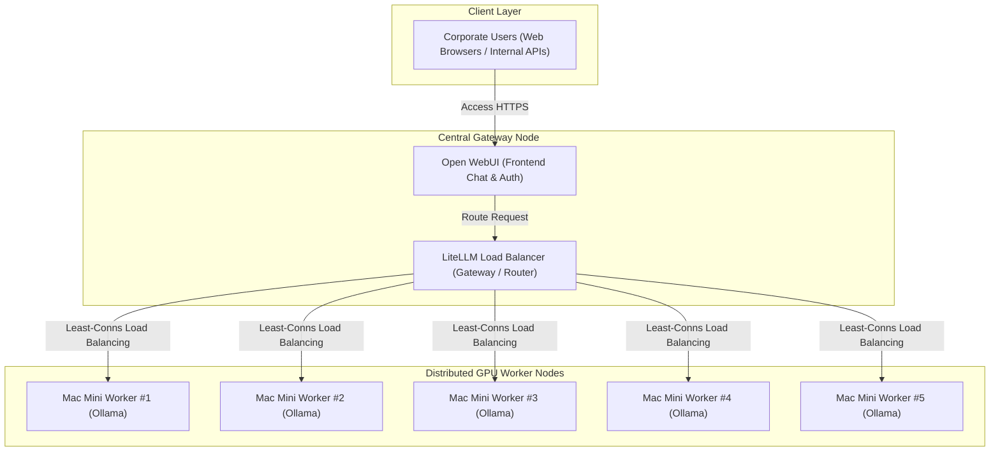
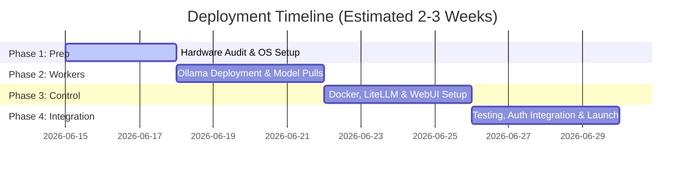

# Project Proposal: In-House Private AI Cluster Deployment
**Project Goal:** Deploying a secure, zero-marginal-cost local AI platform for 100+ users using existing Mac Mini hardware assets.

---

## 1. Executive Summary

This proposal outlines the strategy, architecture, and timeline for deploying an **in-house Private AI Cluster** utilizing the organization's existing inventory of **4 to 5 Apple Silicon Mac Minis**. By transitioning daily AI tasks from external cloud APIs (e.g., OpenAI, Anthropic, Google Gemini) to a self-hosted local cluster, the organization will achieve two primary strategic goals:

1. **Complete Cost Elimination:** Zero-token-cost operation for standard queries, offering massive financial savings.
2. **Absolute Data Privacy:** All prompt queries, source code, and corporate documents processed by the AI remain entirely within the local area network (LAN), satisfying strict security and compliance standards.

---

## 2. Business Case & Financial Comparison

Currently, hosting 100+ active users on commercial cloud AI services presents escalating recurring costs and data leakage risks. Below is a financial projection comparing cloud-hosted APIs against the proposed self-hosted local cluster over a 12-month period.

### Cost Comparison Table (Est. 100 Users)

| Cost Category | Commercial Cloud APIs (e.g., OpenAI/Gemini) | Local Mac Mini AI Cluster |
| :--- | :--- | :--- |
| **Hardware Capital Expense (CapEx)** | $0 (Assuming use of existing client machines) | $0 (Utilizing existing 4-5 Mac Minis) |
| **Token Cost (OpEx)** | ~$1,500 – $3,000 / month (Based on usage) | **$0 / month** |
| **Electricity & Networking** | $0 | ~$30 – $50 / month (Additional power draw) |
| **Software Licensing** | $20 / user / month (SaaS subscriptions) | **$0** (100% Open-Source Enterprise Stack) |
| **Data Privacy Insurance / Risk** | High liability risk (Data sent to external servers) | **Zero Risk** (Data never leaves the office LAN) |
| **Estimated Annual Cost** | **$24,000 – $40,000 / year** | **$360 – $600 / year** |

---

## 3. High-Level Technical Architecture

The cluster utilizes a distributed gateway-worker topology to optimize hardware load and handle concurrency for 100+ users.

### Core Technologies
* **Inference Engine:** `Ollama` running natively on macOS (with Metal GPU acceleration).
* **Load Balancer & API Router:** `LiteLLM` running in a Docker container to balance API traffic across worker nodes.
* **Unified Web Portal:** `Open WebUI` providing a multi-user interface with local database storage for chat histories.

---

## 4. Hardware & Software Requirements

### Hardware Requirements
* **Primary Gateway Node:** 1x Mac Mini (designated to host LiteLLM, Open WebUI, and PostgreSQL database via Docker).
* **Worker Nodes:** 3-4x Mac Minis (Apple Silicon: M1/M2/M3/M4, minimum 16GB RAM recommended).
* **Network Infrastructure:** High-speed Gigabit Ethernet connections between all Mac Minis to minimize latency.

### Software Requirements
* **Operating System:** macOS Sonoma (or newer) on all nodes.
* **Containers:** Docker Desktop / OrbStack installed on the Primary Gateway Node.
* **Local Models:** 
  * `Qwen 2.5 (7B / 14B)` for highly fast, bilingual general intelligence.
  * `Llama 3.1 (8B)` for coding, text summarization, and email formatting.

---

## 5. Implementation Roadmap & Milestones

We propose a structured 4-phase deployment plan:

### Phase 1: Hardware Configuration and Network Audit (Days 1–3)
* Assign static local IP addresses to all 5 Mac Minis.
* Verify network latency across machines.
* Perform system updates and ensure command-line tools are installed.

### Phase 2: Worker Node Deployment (Days 4–7)
* Install Ollama on worker Macs.
* Enable remote access for Ollama (`OLLAMA_HOST="0.0.0.0"`).
* Pull target models (`llama3.1:8b` and `qwen2.5:7b`) to each worker.

### Phase 3: Gateway & Security Configuration (Days 8–11)
* Set up Docker on the Primary Gateway Mac Mini.
* Configure `LiteLLM` to load-balance traffic using the `least-busy` routing logic.
* Setup `Open WebUI` with custom company branding and localized templates.

### Phase 4: User Authentication & System Handover (Days 12–15)
* Configure user authentication (local email signups or integrate with existing OAuth/Google/Active Directory identity systems).
* Conduct load testing with simulated users.
* Roll out to the 100+ user base.

---

## 6. Key Benefits & Competitive Advantages

* **Immediate Return on Investment (ROI):** Since the hardware is already owned, the setup pays for itself within the first month by replacing commercial API subscriptions.
* **Hybrid Deployment Option:** Configure LiteLLM to dynamically route extra-large, complex prompts to commercial models (like Gemini Pro) while handling 95% of basic requests locally.
* **Document Chat (RAG):** Employees can upload corporate PDFs, spreadsheets, and markdown files safely. Open WebUI parses the files locally and injects them into the context window without transmitting data to external cloud servers.
* **Granular Developer Control:** Software developers can generate private API keys to integrate the local cluster into their IDEs (VS Code, Cursor) or CLI scripts.

---

## 7. Risks and Mitigation Strategies

* **Risk: Concurrency Bottlenecks (100+ Users accessing simultaneously)**
  * *Mitigation:* LiteLLM's queueing system holds requests and streams them as soon as any Mac Mini worker finishes its current generation. Furthermore, running smaller, highly optimized quantized models (Q4_K_M) keeps generation times under 3-5 seconds.
* **Risk: Node Downtime**
  * *Mitigation:* If one Mac Mini crashes, LiteLLM automatically bypasses the offline node and redistributes incoming requests among the remaining active worker Macs.
* **Risk: High Temperature / Hardware Thermal Throttling**
  * *Mitigation:* Ensure Mac Minis are placed in a well-ventilated server rack or office area, as sustained inference tasks will engage the internal fans.
